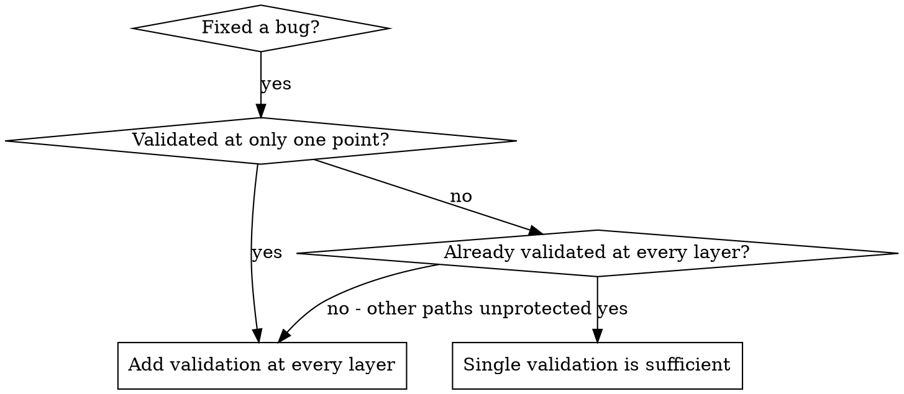

# Defense-in-Depth Validation

## Overview

When you fix a bug caused by invalid data, adding validation at one place feels sufficient. But that single check can be bypassed by different code paths, refactoring, or mocks.

**Core principle:** Validate at EVERY layer data passes through. Make the bug impossible.

## When to Use



**Use when:**
- Fix validates at only the entry point or only the failure site
- Invalid data could reach internal functions from multiple callers
- Tests bypass entry validation via mocks or direct function calls
- Bug could recur through different code paths after refactoring

**Don't use when:**
- Data has a single, controlled entry point with no bypass paths
- Validation at the source already makes the bug structurally impossible

## Quick Reference

| Layer | Purpose | Example |
|-------|---------|---------|
| Entry Point | Reject obviously invalid input at API boundary | Check for empty strings, missing paths |
| Business Logic | Ensure data makes sense for this operation | Verify dependencies between parameters |
| Environment Guards | Prevent dangerous operations in specific contexts | Block filesystem writes outside temp dir in tests |
| Debug Instrumentation | Capture context for forensics | Log directory, cwd, stack trace before operation |

## Why Multiple Layers

Single validation: "We fixed the bug"
Multiple layers: "We made the bug impossible"

Different layers catch different cases:
- Entry validation catches most bugs
- Business logic catches edge cases
- Environment guards prevent context-specific dangers
- Debug logging helps when other layers fail

## The Four Layers

### Layer 1: Entry Point Validation

Reject obviously invalid input at API boundary.

```typescript
function createProject(name: string, workingDirectory: string) {
  if (!workingDirectory || workingDirectory.trim() === '') {
    throw new Error('workingDirectory cannot be empty');
  }
  if (!existsSync(workingDirectory)) {
    throw new Error(`workingDirectory does not exist: ${workingDirectory}`);
  }
  if (!statSync(workingDirectory).isDirectory()) {
    throw new Error(`workingDirectory is not a directory: ${workingDirectory}`);
  }
}
```

### Layer 2: Business Logic Validation

Ensure data makes sense for this operation.

```typescript
function initializeWorkspace(projectDir: string, sessionId: string) {
  if (!projectDir) {
    throw new Error('projectDir required for workspace initialization');
  }
}
```

### Layer 3: Environment Guards

Prevent dangerous operations in specific contexts.

```typescript
async function gitInit(directory: string) {
  if (process.env.NODE_ENV === 'test') {
    const normalized = normalize(resolve(directory));
    const tmpDir = normalize(resolve(tmpdir()));

    if (!normalized.startsWith(tmpDir)) {
      throw new Error(
        `Refusing git init outside temp dir during tests: ${directory}`
      );
    }
  }
}
```

### Layer 4: Debug Instrumentation

Capture context for forensics.

```typescript
async function gitInit(directory: string) {
  const stack = new Error().stack;
  logger.debug('About to git init', {
    directory,
    cwd: process.cwd(),
    stack,
  });
}
```

## Applying the Pattern

When you find a bug:

1. **Trace the data flow** - Where does bad value originate? Where used?
2. **Map all checkpoints** - List every point data passes through
3. **Add validation at each layer** - Entry, business, environment, debug
4. **Test each layer** - Try to bypass layer 1, verify layer 2 catches it

## Key Insight

All four layers are necessary. During testing, each layer catches bugs the others miss:
- Different code paths bypassed entry validation
- Mocks bypassed business logic checks
- Edge cases on different platforms needed environment guards
- Debug logging identified structural misuse

**Don't stop at one validation point.** Add checks at every layer.

## Common Mistakes

| Mistake | Fix |
|---------|-----|
| Only validating at entry point | Mocks and direct calls bypass entry checks — validate inside too |
| Adding guards only in production | Tests run different code paths — add environment guards for test context |
| Logging after the operation fails | Log BEFORE the dangerous operation to capture preconditions |
| Skipping layers because "it works now" | Each layer catches different failure modes — all four are necessary |

## Related Skills

- **superpawers:root-cause-tracing** - Trace bugs backward through call stack to find original trigger
- **superpawers:systematic-debugging** - The full debugging discipline this technique supports
