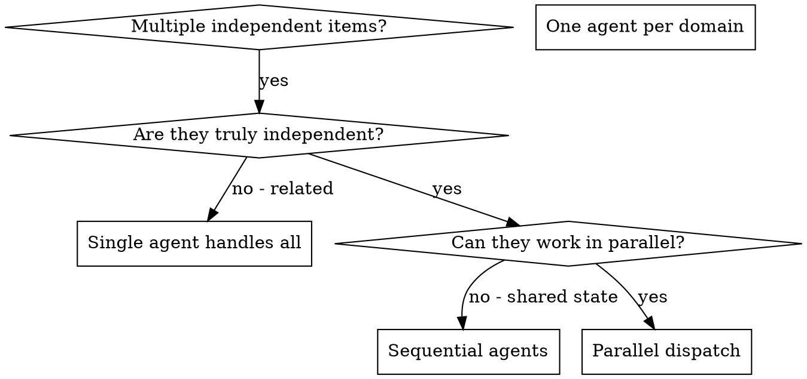

# Dispatching Parallel Agents

## Overview

You delegate tasks to specialized agents with isolated context. By precisely crafting their instructions and context, you ensure they stay focused and succeed at their task. They should never inherit your session's context or history — you construct exactly what they need. This also preserves your own context for coordination work.

When you have multiple independent work items that can proceed without waiting for each other, doing them sequentially wastes time. Each item is independent and can happen in parallel.

**Core principle:** Dispatch one agent per independent problem domain. Let them work concurrently.

## When to Use



**Use when:**
- Multiple subsystems need independent exploration
- 3+ research questions that can be answered simultaneously
- Multiple test files failing with different root causes
- Each problem can be understood without context from others
- No shared state between work items

## When NOT to Use

- Items are related (work on one affects others)
- You need to understand full system state before proceeding
- Agents would interfere with each other (editing same files, same resources)
- You are executing a sequential implementation plan — use `subagent-driven-development` instead
- You do not yet know what is broken or where to look — investigate first, then parallelize

## When to Choose Which Skill

| Situation | Skill |
|-----------|-------|
| Parallel exploration or independent investigations, no shared state | `dispatching-parallel-agents` |
| Sequential execution of a verified plan on one working branch | `subagent-driven-development` |
| Multi-component evidence gathering during Phase 1 of debugging | `dispatching-parallel-agents` (from inside `systematic-debugging`) |

## The Pattern

### 1. Identify Independent Domains

Group work by what's fundamentally separate:

**Research example:**
- File A: Authentication flow exploration
- File B: Database schema exploration
- File C: API endpoint mapping

**Debugging example:**
- File A tests: Tool approval flow
- File B tests: Batch completion behavior
- File C tests: Abort functionality

Each domain is independent - research on authentication doesn't affect database exploration.

### 2. Create Focused Agent Tasks

Each agent gets:
- **Specific scope:** One file, subsystem, or question
- **Clear goal:** What to find, fix, or produce
- **Constraints:** What NOT to touch
- **Expected output:** What to return

### 3. Dispatch in Parallel

```
// Dispatch three focused agents concurrently
Task("Explore authentication system")
Task("Map database schema")
Task("Document API endpoints")
// All three run concurrently
```

### 4. Review and Integrate

When agents return:
- Read each summary
- Verify no conflicts
- Combine findings into coherent picture
- Run appropriate verification for work type

## Agent Prompt Structure

Good agent prompts are:
1. **Focused** - One clear problem domain
2. **Self-contained** - All context needed to understand the problem
3. **Specific about output** - What should the agent return?

```markdown
## Research Example

Explore the authentication system and report:

1. How does the system handle login/logout?
2. What tokens are used and where are they stored?
3. What protected routes require authentication?

Return: Structured findings with file:line references.

## Debugging Example

Fix the 3 failing tests in src/agents/agent-tool-abort.test.ts:

1. "should abort tool with partial output capture" - expects 'interrupted at' in message
2. "should handle mixed completed and aborted tools" - fast tool aborted instead of completed
3. "should properly track pendingToolCount" - expects 3 results but gets 0

These are timing/race condition issues. Your task:

1. Read the test file and understand what each test verifies
2. Identify root cause - timing issues or actual bugs?
3. Fix by:
   - Replacing arbitrary timeouts with event-based waiting
   - Fixing bugs in abort implementation if found

Return: Summary of what you found and what you fixed.
```

## Common Mistakes

**❌ Too broad:** "Explore the codebase" - agent gets lost
**✅ Specific:** "Map the authentication flow" - focused scope

**❌ No context:** "Find the bugs" - agent doesn't know where
**✅ Context:** Paste the error messages and test names

**❌ No constraints:** Agent might refactor everything
**✅ Constraints:** "Focus on X, don't touch Y"

**❌ Vague output:** "Done" - you don't know what changed
**✅ Specific:** "Return structured findings with file:line references"

## Parallel Research Example

**Scenario:** Need to understand a large codebase before implementation

**Questions:**
- How is authentication structured?
- What database patterns are used?
- What testing framework and patterns exist?

**Decision:** Each is independent - can explore all simultaneously

**Dispatch:**
```
Agent 1 → Explore authentication system
Agent 2 → Map database patterns
Agent 3 → Document testing setup
```

**Results:**
- Agent 1: Found 3 auth strategies, middleware chain structure
- Agent 2: Identified ORM usage, migration patterns, 5 core models
- Agent 3: Jest with mocking patterns, 3 test file conventions

**Integration:** Combined into coherent architecture overview

## Key Benefits

1. **Parallelization** - Multiple investigations happen simultaneously
2. **Focus** - Each agent has narrow scope, less context to track
3. **Independence** - Agents don't interfere with each other
4. **Speed** - 3 problems solved in time of 1

## Verification

After agents return:
1. **Review each summary** - Understand what each found
2. **Check for conflicts** - Any contradictory findings?
3. **Run appropriate verification** - Tests, typecheck, or manual review
4. **Spot check** - Agents can miss edge cases