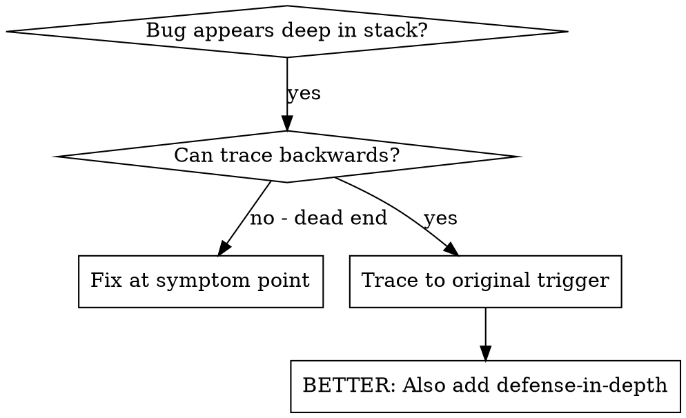
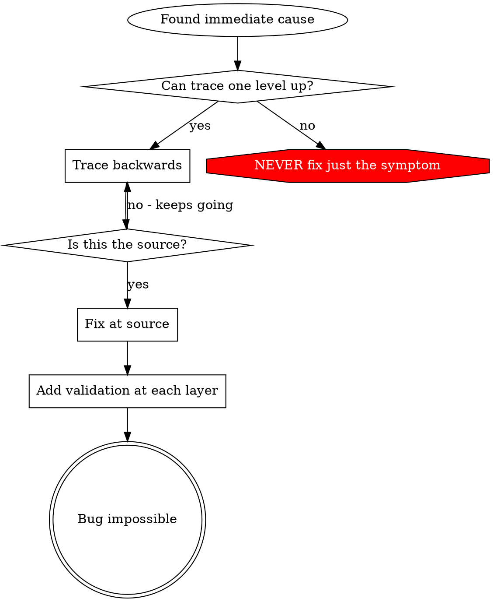

# Root Cause Tracing

## Overview

Bugs often manifest deep in the call stack (file created in wrong location, database opened with wrong path, command run in wrong directory). Your instinct is to fix where the error appears, but that's treating a symptom.

**Core principle:** Trace backward through the call chain until you find the original trigger, then fix at the source.

## When to Use



- Error happens deep in execution (not at entry point)
- Stack trace shows long call chain
- Unclear where invalid data originated
- Need to find which test/code triggers the problem

## Quick Reference

| Step | Action | Key Question |
|------|--------|-------------|
| 1. Observe | Note the error message and location | What exactly failed? |
| 2. Immediate Cause | Find the code that directly triggered the error | What line produced the bad value? |
| 3. Trace Up | Follow the call chain backward one level | What called this function? |
| 4. Keep Tracing | Continue up the chain checking each caller | Where did the invalid value come from? |
| 5. Original Trigger | Identify the first function that introduced bad data | What test or code path started this? |

## The Tracing Process

### 1. Observe the Symptom

```
Error: git init failed in /project/packages/core
```

### 2. Find Immediate Cause

What code directly causes this?

```typescript
await execFileAsync('git', ['init'], { cwd: projectDir });
```

### 3. Ask: What Called This?

```typescript
WorktreeManager.createSessionWorktree(projectDir, sessionId)
  -> called by Session.initializeWorkspace()
  -> called by Session.create()
  -> called by test at Project.create()
```

### 4. Keep Tracing Up

What value was passed?

- `projectDir = ''` (empty string!)
- Empty string as `cwd` resolves to `process.cwd()`
- That's the source code directory!

### 5. Find Original Trigger

Where did empty string come from?

```typescript
const context = setupTest(); // Returns { tempDir: '' }
Project.create('name', context.tempDir); // Accessed before beforeEach!
```

## Adding Stack Traces

When you can't trace manually, add instrumentation:

```typescript
async function dangerousOperation(directory: string) {
  const stack = new Error().stack;
  console.error('DEBUG dangerous operation:', {
    directory,
    cwd: process.cwd(),
    nodeEnv: process.env.NODE_ENV,
    stack,
  });

  await execFileAsync('some-cmd', ['init'], { cwd: directory });
}
```

**Critical:** Use `console.error()` in tests (not logger - may not show)

**Run and capture:**

```bash
npm test 2>&1 | grep 'DEBUG dangerous operation'
```

**Analyze stack traces:**
- Look for test file names
- Find the line number triggering the call
- Identify the pattern (same test? same parameter?)

## Finding Which Test Causes Pollution

If something appears during tests but you don't know which test:

Use the bisection script `find-polluter.sh` in this directory:

```bash
./find-polluter.sh '.git' 'src/**/*.test.ts'
```

Runs tests one-by-one, stops at first polluter. See script for usage.

## Key Principle



**NEVER fix just where the error appears.** Trace back to find the original trigger.

## Stack Trace Tips

- In tests: Use `console.error()` not logger - logger may be suppressed
- Before operation: Log before the dangerous operation, not after it fails
- Include context: Directory, cwd, environment variables, timestamps
- Capture stack: `new Error().stack` shows complete call chain

## Related Skills

- **superpawers:defense-in-depth** - Add validation at multiple layers after finding root cause
- **superpawers:systematic-debugging** - The full debugging discipline this technique supports
- **superpawers:condition-based-waiting** - Replace arbitrary timeouts with condition polling
