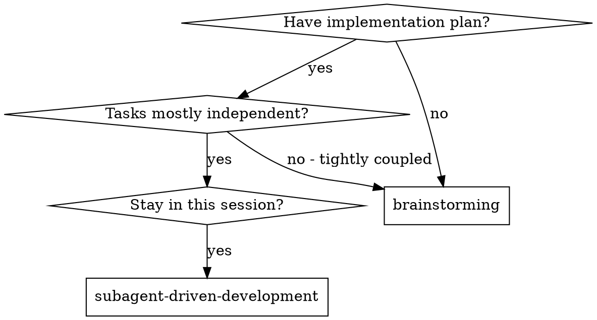

# Subagent-Driven Development

Execute plan by dispatching fresh subagent per task, with review after each. Choose verification level appropriate to task complexity.

**Why subagents:** You delegate tasks to specialized agents with isolated context. By precisely crafting their instructions and context, you ensure they stay focused and succeed at their task. They should never inherit your session's context or history — you construct exactly what they need. This also preserves your own context for coordination work.

**Core principle:** Fresh subagent per task + appropriate review and verification = high quality, fast iteration

## When to Use



## The Process

```dot
digraph process {
    rankdir=TB;

    subgraph cluster_per_task {
        label="Per Task";
        "Dispatch implementer subagent" [shape=box];
        "Implementer subagent status?" [shape=diamond];
        "Human recovery options (structured: 1. Plan recovery, 2. Discard, 3. Keep)" [shape=box style=filled fillcolor=lightyellow];
        "Implementer subagent asks questions?" [shape=diamond];
        "Answer questions, provide context" [shape=box];
        "Implementer subagent implements, tests, commits, self-reviews" [shape=box];
        "Choose review level (spec, quality, or both)" [shape=diamond];
        "Dispatch reviewer subagent" [shape=box];
        "Reviewer approves?" [shape=diamond];
        "Implementer subagent fixes issues" [shape=box];
        "Mark task complete in todowrite" [shape=box];
    }

    "Read plan, extract all tasks with full text, note context, create todowrite" [shape=box];
    "More tasks remain?" [shape=diamond];
    "Verify entire implementation (inline or subagent)" [shape=box];
    "Verification passes?" [shape=diamond];
    "Use superpawers:finishing-a-development-branch" [shape=box style=filled fillcolor=lightgreen];
    "Human recovery options (structured: 1. Plan recovery, 2. Discard, 3. Keep)" [shape=box style=filled fillcolor=lightyellow];
    "Exit" [shape=doublecircle];

    "Read plan, extract all tasks with full text, note context, create todowrite" -> "Dispatch implementer subagent";
    "Dispatch implementer subagent" -> "Implementer subagent status?";
    "Implementer subagent asks questions?" -> "Implementer subagent implements, tests, commits, self-reviews" [label="no"];
    "Implementer subagent implements, tests, commits, self-reviews" -> "Choose review level (spec, quality, or both)";
    "Choose review level (spec, quality, or both)" -> "Dispatch reviewer subagent";
    "Dispatch reviewer subagent" -> "Reviewer approves?";
    "Reviewer approves?" -> "Implementer subagent fixes issues" [label="no"];
    "Implementer subagent fixes issues" -> "Dispatch reviewer subagent" [label="re-review"];
    "Reviewer approves?" -> "Mark task complete in todowrite" [label="yes"];
    "Mark task complete in todowrite" -> "More tasks remain?";
    "More tasks remain?" -> "Dispatch implementer subagent" [label="yes"];
    "More tasks remain?" -> "Verify entire implementation (inline or subagent)" [label="no"];
    "Verify entire implementation (inline or subagent)" -> "Verification passes?";
    "Verification passes?" -> "Use superpawers:finishing-a-development-branch" [label="yes"];
    "Verification passes?" -> "Human recovery options (structured: 1. Plan recovery, 2. Discard, 3. Keep)" [label="fail"];
    "Human recovery options (structured: 1. Plan recovery, 2. Discard, 3. Keep)" -> "Exit" [label="after recovery"];
}
```



## Model Selection

Use the least powerful model that can handle each role to conserve cost and increase speed.

**Mechanical implementation tasks** (isolated functions, clear specs, 1-2 files): use a fast, cheap model. Most implementation tasks are mechanical when the plan is well-specified.

**Integration and judgment tasks** (multi-file coordination, pattern matching, debugging): use a standard model.

**Architecture, design, and review tasks**: use the most capable available model.

**Task complexity signals:**
- Touches 1-2 files with a complete spec → cheap model
- Touches multiple files with integration concerns → standard model
- Requires design judgment or broad codebase understanding → most capable model

## Task Grouping

The plan defines tasks. You decide how to dispatch them.

**One subagent = one dispatch unit.** A dispatch unit may cover one or many plan tasks. Use your judgment:

**Combine into one dispatch when:**
- Plan explicitly says tasks must be done together (e.g., "combine with Task N")
- Tasks share state (same files, same API surface)
- Doing them separately would break tests

**Keep separate when:**
- Tasks are truly independent (different files, no shared state)
- One task's output is another's input (sequential dependency)
- You want review gates between tasks (complex logic worth checking incrementally)

**Principle:** The subagent should be able to succeed without needing context from a concurrent task. If two tasks touch the same code, they're probably one dispatch unit.

## Verification Strategy

Choose the right verification level based on task complexity. The goal is always to verify — but *how* you verify should match the task.

### Per-task review (after implementer completes)

**Spec compliance review** (dispatch reviewer subagent):
- Task has non-trivial requirements or acceptance criteria
- Implementation spans multiple files or concepts
- Risk of overbuilding or underbuilding

**Code quality review** (dispatch reviewer subagent):
- Task introduces new patterns or abstractions
- Code will be foundational for future tasks
- Complexity warrants a second set of eyes

**Combined spec+quality review:**
- Use for tasks that are both complex and foundational

**Skip formal review when:**
- Task is mechanical (rename, delete files, move code)
- Implementation is trivially correct (1-2 line change)
- Implementer's self-review + your quick glance is sufficient

**Batched review for small task groups:**
- When you've completed several trivial/mechanical tasks in sequence without individual reviews
- Dispatch one reviewer covering all of them together
- More efficient than N separate reviews, same coverage
- Review loop still applies: if the batched review finds issues, fix → re-review

**Guideline:** Review your judgment. When in doubt, review. The cost of a review is low; the cost of shipping a bug is high.

### Final verification (after all tasks)

Choose based on implementation scope:

**Inline verification** (you run commands via Bash):
- Standard test/lint/typecheck commands cover the changes
- No complex environment setup needed
- You understand what to run and what to expect

**Verifier subagent** (dispatch fresh agent):
- Multi-task integration testing needed
- Complex test environment or dependencies
- You're unsure what test commands cover the full changeset
- Changes span many files and you want independent confirmation

**Do not** skip final verification entirely. But you may choose *how* to verify.

## Handling Implementer Status

Implementer subagents report one of four statuses. Handle each appropriately:

**DONE:** Proceed to review (or mark complete if review not needed for this task).

**DONE_WITH_CONCERNS:** The implementer completed the work but flagged doubts. Read the concerns before proceeding. If the concerns are about correctness or scope, address them before review. If they're observations (e.g., "this file is getting large"), note them and proceed to review.

**NEEDS_CONTEXT:** The implementer needs information that wasn't provided. Provide the missing context and re-dispatch.

**BLOCKED:** The implementer cannot complete the task. Assess the blocker:
1. If it's a context problem, provide more context and re-dispatch with the same model
2. If the task requires more reasoning, re-dispatch with a more capable model
3. If the task is too large, break it into smaller pieces
4. If the plan itself is wrong, escalate to the human

**Never** ignore an escalation or force the same model to retry without changes. If the implementer said it's stuck, something needs to change.

**Fail-Fast:** If any subagent returns **BLOCKED** or experiences repeated failures:
1. **STOP immediately** — do not fall back to inline execution
2. Present human recovery options:
   - **Plan recovery:** Fix the plan, then continue
   - **Discard:** Abandon this approach entirely
   - **Keep:** Accept current state and move on

## Prompt Templates

Agent base prompts live in `agents/`. Skills provide task-specific context when dispatching via `@superpawers-implementer`, `@superpawers-reviewer`, `@superpawers-verifier`:

- `implementer.template.md` - Implementer template (in same directory)
- `reviewer.template.md` - Reviewer template (skills specify review focus: spec compliance, code quality, full review)
- `verifier.template.md` - Verifier template (language-agnostic, probes for test infrastructure)

**Dispatch format:**
```
@superpawers-implementer: "Implement Task N: [task name]"

[Paste full task text from plan]
[Paste relevant context]

[Then inject implementer.template.md content]
```

## Example Workflows

### Standard workflow (complex tasks)

```
You: I'm using Subagent-Driven Development to execute this plan.

[Read plan file once: .superpawers/plans/feature-plan.md]
[Extract all 5 tasks with full text and context]
[Create todowrite with all tasks]

Task 1: Hook installation script

[Get Task 1 text and context (already extracted)]
[Dispatch implementation subagent with full task text + context]

Implementer: "Before I begin - should the hook be installed at user or system level?"

You: "User level (~/.config/superpowers/hooks/)"

Implementer: "Got it. Implementing now..."
[Later] Implementer:
  - Implemented install-hook command
  - Added tests, 5/5 passing
  - Self-review: Found I missed --force flag, added it
  - Committed

[Dispatch spec compliance reviewer]
Reviewer: ✅ Spec compliant - all requirements met, nothing extra

[Get git SHAs, dispatch code quality reviewer]
Code reviewer: Strengths: Good test coverage, clean. Issues: None. Approved.

[Mark Task 1 complete]

Task 2: Recovery modes

[Get Task 2 text and context (already extracted)]
[Dispatch implementation subagent with full task text + context]

Implementer: [No questions, proceeds]
Implementer:
  - Added verify/repair modes
  - 8/8 tests passing
  - Self-review: All good
  - Committed

[Dispatch spec compliance reviewer]
Reviewer: ❌ Issues:
   - Missing: Progress reporting (spec says "report every 100 items")
   - Extra: Added --json flag (not requested)

[Implementer fixes issues]
Implementer: Removed --json flag, added progress reporting

[Reviewer reviews again]
Reviewer: ✅ Spec compliant now

[Dispatch code quality reviewer]
Reviewer: Strengths: Solid. Issues (Important): Magic number (100)

[Implementer fixes]
Implementer: Extracted PROGRESS_INTERVAL constant

[Reviewer reviews again]
Reviewer: ✅ Approved

[Mark Task 2 complete]

...

[After all tasks]
[Assess verification needs: standard test suite covers changes]
[Run inline verification: npm test, npm run lint — all pass]
→ Verification PASS

[Use superpawers:finishing-a-development-branch]

Done!
```

### Grouped tasks workflow (coupled plan tasks)

Plan has 6 tasks. Tasks 1-2 are additive (new files only). Tasks 3-5 are tightly coupled — the plan says "combine Tasks 3-5 into one commit to keep tests green." Task 6 is verification.

```
[Read plan, extract all 6 tasks]
[Create todowrite: Task 1, Task 2, Tasks 3-5 (combined), Task 6]

Task 1: Create AgentHandler protocol (new files only)

[Dispatch implementer with Task 1 text + context]
Implementer: DONE. Created agents/__init__.py, agents/handler.py

[Task is mechanical — skip formal review, quick glance suffices]
[Mark Task 1 complete]

Task 2: Create chat agent implementation (new files only)

[Dispatch implementer with Task 2 text + context]
Implementer: DONE. Created agents/chat/__init__.py, state.py, nodes.py, handler.py

[Batch review: Task 1 + Task 2 together since both are trivial additive work]
[Dispatch reviewer covering both tasks: spec compliance]
Reviewer: ✅ Both match spec

[Mark Task 2 complete]

Tasks 3-5: Genericize engine, refactor runtime, delete old files (combined)

[Plan says these must be done together — dispatch as one unit]
[Dispatch implementer with Tasks 3, 4, AND 5 text + all relevant context]
Implementer:
  - Genericized engine API
  - Updated bootstrap/service to use new API
  - Deleted old files
  - Updated all tests
  - All tests passing
  - Committed

[Dispatch spec compliance reviewer for the combined change]
Reviewer: ✅ All three tasks match their specs

[Dispatch code quality reviewer]
Reviewer: ✅ Approved

[Mark Tasks 3-5 complete]

Task 6: Final verification
[Run inline verification: all tests pass]
```

Key differences from the standard workflow:
- **Task grouping:** Tasks 3-5 become one dispatch because the plan says to combine them
- **Review batching:** Tasks 1-2 get one combined review instead of two separate ones
- **Skip review judgment:** Task 1 was so trivial it could have skipped review entirely; batching with Task 2 was pragmatic

## Advantages

**vs. Manual execution:**
- Subagents follow TDD naturally
- Fresh context per task (no confusion)
- Parallel-safe (subagents don't interfere)
- Subagent can ask questions (before AND during work)

**Efficiency gains:**
- No file reading overhead (controller provides full text)
- Controller curates exactly what context is needed
- Subagent gets complete information upfront
- Questions surfaced before work begins (not after)

**Quality gates:**
- Self-review catches issues before handoff
- Review cycle calibrated to task complexity
- Verification matches implementation scope
- Spec compliance prevents over/under-building
- Code quality ensures implementation is well-built

**Cost:**
- Subagent invocations scale with task complexity (not one-size-fits-all)
- Controller does more prep work (extracting all tasks upfront)
- Review loops add iterations only when needed
- But catches issues early (cheaper than debugging later)

## Red Flags

**Always:**
- Verify every task — but match verification to complexity
- Review before marking complete — use your judgment on depth
- Fix issues before moving on — don't accumulate technical debt

**Never:**
- Start implementation on main/master branch without explicit user consent
- Dispatch multiple implementation subagents in parallel (conflicts)
- Make subagent read plan file (provide full text instead)
- Skip scene-setting context (subagent needs to understand where task fits)
- Ignore subagent questions (answer before letting them proceed)
- Skip re-review when reviewer found issues (fix → review again, always)
- **Fall back to inline execution when subagent fails** (STOP and present human recovery options instead)

**Guidelines (use judgment):**
- Spec compliance before code quality is the right order, but for simple tasks a combined review is fine
- When in doubt, review. The cost is low; the cost of shipping bugs is high.
- For trivially mechanical tasks, implementer self-review + your glance may suffice
- For a batch of small tasks, one combined review is more efficient than N separate ones
- Combine tightly coupled plan tasks into one dispatch (see Task Grouping section)

**If subagent asks questions:**
- Answer clearly and completely
- Provide additional context if needed
- Don't rush them into implementation

**If reviewer finds issues:**
- Implementer (same subagent) fixes them
- Reviewer reviews again
- Repeat until approved
- Don't skip the re-review

**If subagent fails task:**
- Dispatch fix subagent with specific instructions
- Don't try to fix manually (context pollution)

## Integration

**Required workflow skills:**
- **superpawers:using-git-branches** - REQUIRED: Set up isolated branch before starting
- **superpawers:writing-plans** - Creates the plan this skill executes
- **superpawers:requesting-code-review** - Ad-hoc code review using the consolidated reviewer template
- **superpawers:finishing-a-development-branch** - Complete development after all tasks

**Subagents should use:**
- **superpawers:test-driven-development** - Subagents follow TDD for each task
