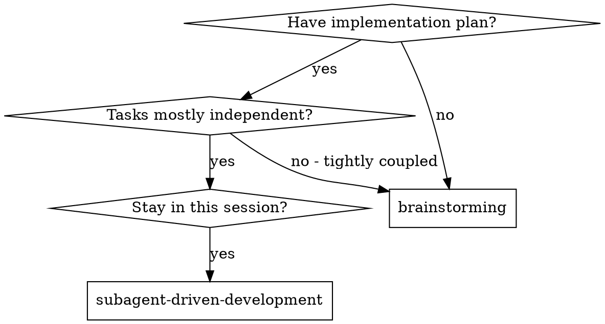

# Subagent-Driven Development

Execute plan by dispatching fresh subagent per task, with review after each: spec compliance first, then code quality.

**Why subagents:** You delegate tasks to specialized agents with isolated context. By precisely crafting their instructions and context, you ensure they stay focused and succeed at their task. They should never inherit your session's context or history — you construct exactly what they need. This also preserves your own context for coordination work.

**Core principle:** Fresh subagent per task + review cycle (spec then quality) = high quality, fast iteration

## When to Use



## The Process

```dot
digraph process {
    rankdir=TB;

    subgraph cluster_per_task {
        label="Per Task";
        "Dispatch implementer subagent" [shape=box];
        "Implementer subagent status?" [shape=diamond];
        "Human recovery options (structured: 1. Plan recovery, 2. Discard, 3. Keep)" [shape=box style=filled fillcolor=lightyellow];
        "Implementer subagent asks questions?" [shape=diamond];
        "Answer questions, provide context" [shape=box];
        "Implementer subagent implements, tests, commits, self-reviews" [shape=box];
        "Dispatch reviewer subagent (spec compliance)" [shape=box];
        "Reviewer confirms code matches spec?" [shape=diamond];
        "Implementer subagent fixes spec gaps" [shape=box];
        "Dispatch reviewer subagent (code quality)" [shape=box];
        "Reviewer approves code quality?" [shape=diamond];
        "Implementer subagent fixes quality issues" [shape=box];
        "Mark task complete in todowrite" [shape=box];
    }

    "Read plan, extract all tasks with full text, note context, create todowrite" [shape=box];
    "More tasks remain?" [shape=diamond];
    "Dispatch final reviewer subagent for entire implementation" [shape=box];
    "Dispatch verifier subagent" [shape=box];
    "Verifier reports PASS?" [shape=diamond];
    "Use superpawers:finishing-a-development-branch" [shape=box style=filled fillcolor=lightgreen];
    "Human recovery options (structured: 1. Plan recovery, 2. Discard, 3. Keep)" [shape=box style=filled fillcolor=lightyellow];
    "Exit" [shape=doublecircle];

    "Read plan, extract all tasks with full text, note context, create todowrite" -> "Dispatch implementer subagent";
    "Dispatch implementer subagent" -> "Implementer subagent status?";
    "Implementer subagent asks questions?" -> "Implementer subagent implements, tests, commits, self-reviews" [label="no"];
    "Implementer subagent implements, tests, commits, self-reviews" -> "Dispatch reviewer subagent (spec compliance)";
    "Dispatch reviewer subagent (spec compliance)" -> "Reviewer confirms code matches spec?";
    "Reviewer confirms code matches spec?" -> "Implementer subagent fixes spec gaps" [label="no"];
    "Implementer subagent fixes spec gaps" -> "Dispatch reviewer subagent (spec compliance)" [label="re-review"];
    "Reviewer confirms code matches spec?" -> "Dispatch reviewer subagent (code quality)" [label="yes"];
    "Dispatch reviewer subagent (code quality)" -> "Reviewer approves code quality?";
    "Reviewer approves code quality?" -> "Implementer subagent fixes quality issues" [label="no"];
    "Implementer subagent fixes quality issues" -> "Dispatch reviewer subagent (code quality)" [label="re-review"];
    "Reviewer approves code quality?" -> "Mark task complete in todowrite" [label="yes"];
    "Mark task complete in todowrite" -> "More tasks remain?";
    "More tasks remain?" -> "Dispatch implementer subagent" [label="yes"];
    "More tasks remain?" -> "Dispatch final reviewer subagent for entire implementation" [label="no"];
    "Dispatch final reviewer subagent for entire implementation" -> "Dispatch verifier subagent";
    "Dispatch verifier subagent" -> "Verifier reports PASS?";
    "Verifier reports PASS?" -> "Use superpawers:finishing-a-development-branch" [label="yes"];
    "Verifier reports PASS?" -> "Human recovery options (structured: 1. Plan recovery, 2. Discard, 3. Keep)" [label="fail"];
    "Human recovery options (structured: 1. Plan recovery, 2. Discard, 3. Keep)" -> "Exit" [label="after recovery"];
}
```



## Model Selection

Use the least powerful model that can handle each role to conserve cost and increase speed.

**Mechanical implementation tasks** (isolated functions, clear specs, 1-2 files): use a fast, cheap model. Most implementation tasks are mechanical when the plan is well-specified.

**Integration and judgment tasks** (multi-file coordination, pattern matching, debugging): use a standard model.

**Architecture, design, and review tasks**: use the most capable available model.

**Task complexity signals:**
- Touches 1-2 files with a complete spec → cheap model
- Touches multiple files with integration concerns → standard model
- Requires design judgment or broad codebase understanding → most capable model

## Handling Implementer Status

Implementer subagents report one of four statuses. Handle each appropriately:

**DONE:** Proceed to spec compliance review.

**DONE_WITH_CONCERNS:** The implementer completed the work but flagged doubts. Read the concerns before proceeding. If the concerns are about correctness or scope, address them before review. If they're observations (e.g., "this file is getting large"), note them and proceed to review.

**NEEDS_CONTEXT:** The implementer needs information that wasn't provided. Provide the missing context and re-dispatch.

**BLOCKED:** The implementer cannot complete the task. Assess the blocker:
1. If it's a context problem, provide more context and re-dispatch with the same model
2. If the task requires more reasoning, re-dispatch with a more capable model
3. If the task is too large, break it into smaller pieces
4. If the plan itself is wrong, escalate to the human

**Never** ignore an escalation or force the same model to retry without changes. If the implementer said it's stuck, something needs to change.

**Fail-Fast:** If any subagent returns **BLOCKED** or experiences repeated failures:
1. **STOP immediately** — do not fall back to inline execution
2. Present human recovery options:
   - **Plan recovery:** Fix the plan, then continue
   - **Discard:** Abandon this approach entirely
   - **Keep:** Accept current state and move on

## Prompt Templates

Agent base prompts live in `agents/`. Skills provide task-specific context when dispatching via `@superpawers:implementer`, `@superpawers:reviewer`, `@superpawers:verifier`:

- `implementer.template.md` - Implementer template (in same directory)
- `reviewer.template.md` - Reviewer template (skills specify review focus: spec compliance, code quality, full review)
- `verifier.template.md` - Verifier template (language-agnostic, probes for test infrastructure)

**Dispatch format:**
```
@superpawers:implementer: "Implement Task N: [task name]"

[Paste full task text from plan]
[Paste relevant context]

[Then inject implementer.template.md content]
```

## Example Workflow

```
You: I'm using Subagent-Driven Development to execute this plan.

[Read plan file once: .superpawers/plans/feature-plan.md]
[Extract all 5 tasks with full text and context]
[Create todowrite with all tasks]

Task 1: Hook installation script

[Get Task 1 text and context (already extracted)]
[Dispatch implementation subagent with full task text + context]

Implementer: "Before I begin - should the hook be installed at user or system level?"

You: "User level (~/.config/superpowers/hooks/)"

Implementer: "Got it. Implementing now..."
[Later] Implementer:
  - Implemented install-hook command
  - Added tests, 5/5 passing
  - Self-review: Found I missed --force flag, added it
  - Committed

[Dispatch spec compliance reviewer]
Reviewer: ✅ Spec compliant - all requirements met, nothing extra

[Get git SHAs, dispatch code quality reviewer]
Code reviewer: Strengths: Good test coverage, clean. Issues: None. Approved.

[Mark Task 1 complete]

Task 2: Recovery modes

[Get Task 2 text and context (already extracted)]
[Dispatch implementation subagent with full task text + context]

Implementer: [No questions, proceeds]
Implementer:
  - Added verify/repair modes
  - 8/8 tests passing
  - Self-review: All good
  - Committed

[Dispatch spec compliance reviewer]
Reviewer: ❌ Issues:
   - Missing: Progress reporting (spec says "report every 100 items")
   - Extra: Added --json flag (not requested)

[Implementer fixes issues]
Implementer: Removed --json flag, added progress reporting

[Reviewer reviews again]
Reviewer: ✅ Spec compliant now

[Dispatch code quality reviewer]
Reviewer: Strengths: Solid. Issues (Important): Magic number (100)

[Implementer fixes]
Implementer: Extracted PROGRESS_INTERVAL constant

[Reviewer reviews again]
Reviewer: ✅ Approved

[Mark Task 2 complete]

...

[After all tasks]
[Dispatch final reviewer for entire implementation]
Final reviewer: All requirements met, ready to merge

Done!
```

## Advantages

**vs. Manual execution:**
- Subagents follow TDD naturally
- Fresh context per task (no confusion)
- Parallel-safe (subagents don't interfere)
- Subagent can ask questions (before AND during work)

**Efficiency gains:**
- No file reading overhead (controller provides full text)
- Controller curates exactly what context is needed
- Subagent gets complete information upfront
- Questions surfaced before work begins (not after)

**Quality gates:**
- Self-review catches issues before handoff
- Review cycle: spec compliance, then code quality
- Review loops ensure fixes actually work
- Spec compliance prevents over/under-building
- Code quality ensures implementation is well-built

**Cost:**
- More subagent invocations (implementer + 2 reviews per task)
- Controller does more prep work (extracting all tasks upfront)
- Review loops add iterations
- But catches issues early (cheaper than debugging later)

## Red Flags

**Never:**
- Start implementation on main/master branch without explicit user consent
- Skip reviews (spec compliance OR code quality)
- Proceed with unfixed issues
- Dispatch multiple implementation subagents in parallel (conflicts)
- Make subagent read plan file (provide full text instead)
- Skip scene-setting context (subagent needs to understand where task fits)
- Ignore subagent questions (answer before letting them proceed)
- Accept "close enough" on spec compliance (spec reviewer found issues = not done)
- Skip review loops (reviewer found issues = implementer fixes = review again)
- Let implementer self-review replace actual review (both are needed)
- **Start code quality review before spec compliance is ✅** (wrong order)
- Move to next task while either review has open issues
- **Fall back to inline execution when subagent fails** (STOP and present human recovery options instead)

**If subagent asks questions:**
- Answer clearly and completely
- Provide additional context if needed
- Don't rush them into implementation

**If reviewer finds issues:**
- Implementer (same subagent) fixes them
- Reviewer reviews again
- Repeat until approved
- Don't skip the re-review

**If subagent fails task:**
- Dispatch fix subagent with specific instructions
- Don't try to fix manually (context pollution)

## Integration

**Required workflow skills:**
- **superpawers:using-git-branches** - REQUIRED: Set up isolated branch before starting
- **superpawers:writing-plans** - Creates the plan this skill executes
- **superpawers:requesting-code-review** - Ad-hoc code review using the consolidated reviewer template
- **superpawers:finishing-a-development-branch** - Complete development after all tasks

**Subagents should use:**
- **superpawers:test-driven-development** - Subagents follow TDD for each task


