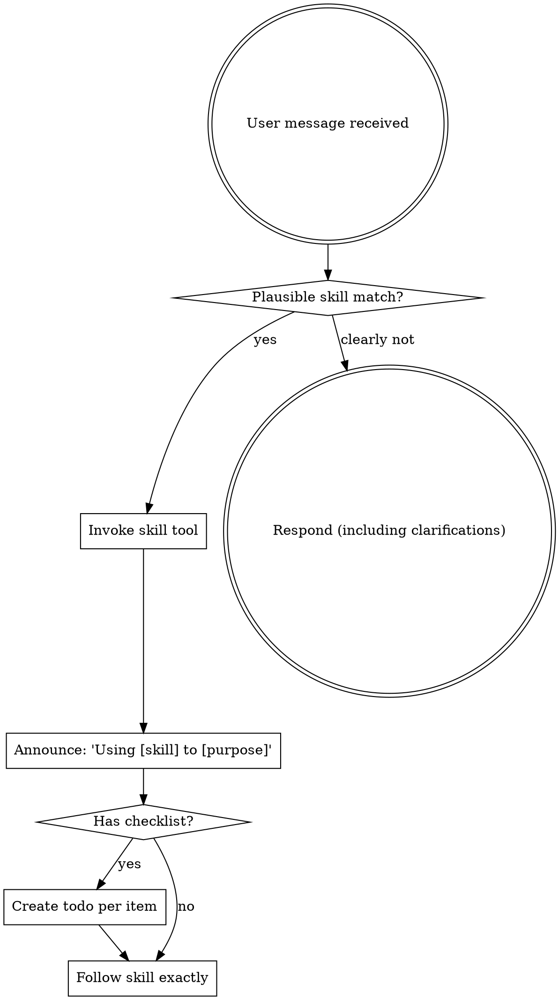

<SUBAGENT-STOP>
If you were dispatched as a subagent to execute a specific task, skip this skill.
</SUBAGENT-STOP>

<EXTREMELY-IMPORTANT>
If a skill plausibly matches the task category or was explicitly requested, load it before acting.

Skills codify the workflow this project trusts. Do not shortcut around them, and do not rationalize your way past the entry router.
</EXTREMELY-IMPORTANT>

## Common Entry Points

Pick one, then invoke that skill first.

| Situation | Start with |
|-----------|------------|
| New feature, behavior change, or vague request | `brainstorming` |
| Approved spec, need a plan | `writing-plans` |
| Approved plan, ready to execute | `subagent-driven-development` |
| Bug, test failure, or unexpected behavior | `systematic-debugging` |
| Incoming human or external review feedback | `receiving-code-review` |
| Need a review before merge or at a milestone | `requesting-code-review` |
| Multiple independent investigations in parallel | `dispatching-parallel-agents` |
| About to claim work is done, passing, or fixed | `verification-before-completion` |
| All tasks complete, ready to merge/PR/discard | `finishing-a-development-branch` |
| Creating or editing a skill | `writing-skills` |

If more than one applies, use this order:

1. Process skills first (`brainstorming`, `systematic-debugging`) — they decide HOW to approach the task.
2. Workflow skills next (`writing-plans`, `subagent-driven-development`) — they decide what to do and in what order.
3. Quality gates (`verification-before-completion`, review skills) — they govern transitions and claims.

## Instruction Priority

SuperPawers skills override default system prompt behavior, but **user instructions always take precedence**:

1. **User's explicit instructions** (AGENTS.md, direct requests) — highest priority
2. **SuperPawers skills** — override default system behavior where they conflict
3. **Default system prompt** — lowest priority

If AGENTS.md says "don't use TDD" and a skill says "always use TDD," follow the user's instructions. The user is in control.

## How to Access Skills

Use the `skill` tool. When you invoke a skill, its content is loaded and presented to you—follow it directly. Never use the read tool on skill files.

## Available Agents

SuperPawers defines these subagents for dispatch:

| Agent | Purpose | System Prompt |
|-------|---------|---------------|
| `@superpawers-researcher` | Explores codebase, gathers context, reports findings | `agents/superpawers-researcher.system.md` |
| `@superpawers-implementer` | Implements tasks following TDD with isolated context | `agents/superpawers-implementer.system.md` |
| `@superpawers-reviewer` | Reviews code quality, spec compliance, and production readiness | `agents/superpawers-reviewer.system.md` |
| `@superpawers-verifier` | Runs tests, lint, and typecheck independently | `agents/superpawers-verifier.system.md` |
| `@superpawers-planner` | Investigates codebase via researchers, produces implementation plans | `agents/superpawers-planner.system.md` |

Dispatch a subagent by mentioning it:
```
@superpawers-implementer implement the auth feature
```

## Using Skills

### The Rule

**If a skill plausibly matches the task category, invoke it before acting.** Skills contain the project's workflow decisions; acting without them invites drift. If an invoked skill turns out to be the wrong one, abandon it and pick the right one — that is cheap. Skipping the router is not.

### Skill Flow



## Red Flags

These thoughts mean STOP—you're rationalizing:

| Thought | Reality |
|---------|---------|
| "This is just a simple question" | Questions are tasks. Check for skills. |
| "I need more context first" | Skill check comes BEFORE clarifying questions. |
| "Let me explore the codebase first" | Skills tell you HOW to explore. Check first. |
| "I can check git/files quickly" | Files lack conversation context. Check for skills. |
| "Let me gather information first" | Skills tell you HOW to gather information. |
| "This doesn't need a formal skill" | If a skill exists, use it. |
| "I remember this skill" | Skills evolve. Read current version. |
| "This doesn't count as a task" | Action = task. Check for skills. |
| "The skill is overkill" | Simple things become complex. Use it. |
| "I'll just do this one thing first" | Check BEFORE doing anything. |
| "This feels productive" | Undisciplined action wastes time. Skills prevent this. |
| "I know what that means" | Knowing the concept ≠ using the skill. Invoke it. |

## Skill Priority

When multiple skills could apply, use this order:

1. **Process skills first** (`brainstorming`, `systematic-debugging`) — these decide HOW to approach the task.
2. **Workflow skills second** (`writing-plans`, `subagent-driven-development`) — these decide what to do and in what order.
3. **Quality gates last** (`verification-before-completion`, `requesting-code-review`, `receiving-code-review`) — these govern transitions and completion claims.

"Let's build X" → `brainstorming` first.
"Fix this bug" → `systematic-debugging` first.
"Review what I just wrote" → `requesting-code-review`.
"Here's the reviewer's feedback" → `receiving-code-review`.

## Skill Types

**Rigid** (TDD, debugging): Follow exactly. Don't adapt away discipline.

**Flexible** (patterns): Adapt principles to context.

The skill itself tells you which.

## User Instructions

Instructions say WHAT, not HOW. "Add X" or "Fix Y" doesn't mean skip workflows.